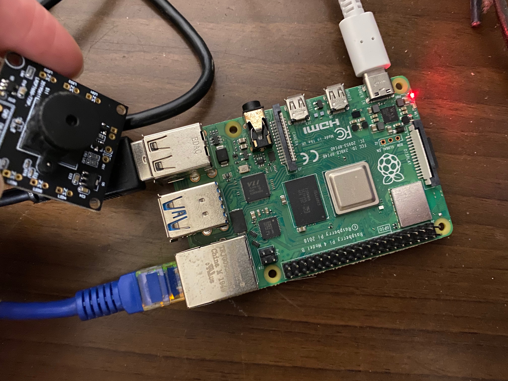
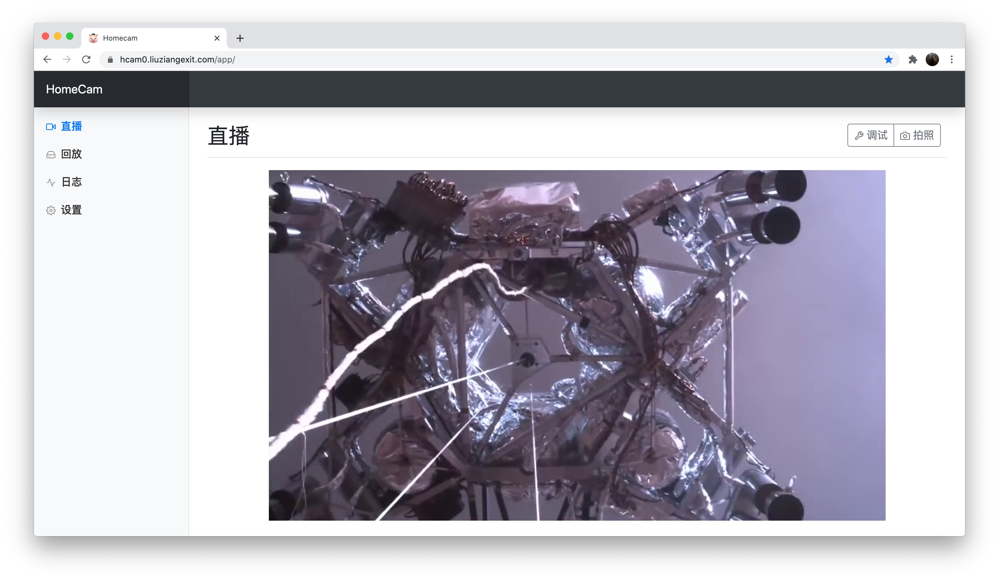
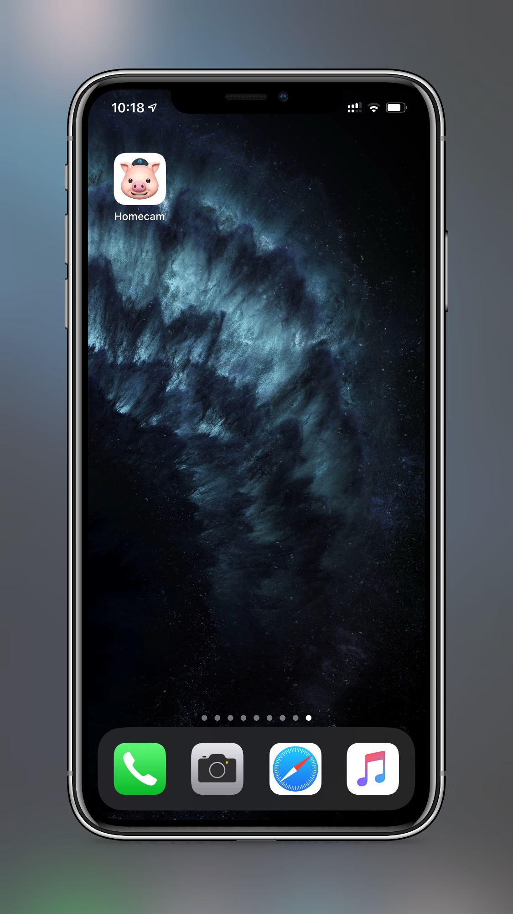

# Homecam

"年轻人的第一个网络摄像头"

有没有什么办法能让我在有一个网络摄像头的同时，又不被摄像头制造商偷窥呢？似乎并没有！所以我自己写了一个。

这个程序是设计给著名的单板计算机树莓派用的（虽然也能在Mac上编译运行...但谁会把Mac用作摄像头呢？），如果你有一个带摄像头的树莓派，那么这个程序就能把你的树莓派变成一个网络监视摄像头。出门在外的时候也可以看到家里的情况，因为可能你家里有只猫或者小孩子什么的。

目前只实现了最基本的功能：网络直播、录像回看。但未来如果有空的话，也许我会加上对象识别和人脸识别的功能，这样如果有个形迹可疑的陌生人在你家门口徘徊，这个程序就可以发送一条通知到你的手机上！

<h2>截图</h2>
这是我自己的硬件，一个树莓派4B，一个淘宝上买的深圳产USB摄像头

这是在电脑浏览器里看直播的效果（当然，这个直播画面是PS上去的）

<br>
这是在手机上看直播的效果（当然，这个直播画面是PS上去的）

<br>
这是在手机桌面样子（是的，我们是有一个pwa程序）

<br>

这是在手机上的启动屏幕（如果你观察地足够仔细，就能发现猪戴的帽子其实是一个摄像头）


<h2>第三方库</h2>

| 名称 | 用途  |
| ------- | ------ |
|OpenCV|用于图像处理。此项目使用的是基于4.5.1版本修改的OpenCV，修改内容主要是通过树莓派的硬件加速接口，增强了图像、视频的处理速度|
|ffmpeg|用于视频编码|
|oneTBB|用于实现一些支持并发的数据结构|
|boost.beast|用于实现web服务器|
|V4L2|用于实现Linux下的视频捕获|
|json|用于json序列化|
|freetype2|用于在视频上写字|
|harfbuzz|用于在视频上写字|

<h2>编译</h2>

就像你在上面看到的那样，由于用的第三方库很多，所以目前编译过程比较复杂，甚至无法在非8GB内存的树莓派上编译（因为编译过程中需要使用6GB左右的内存）。我的树莓派只有2G内存，所以我在一个大内存的PC上交叉编译。

...所以暂时不列出具体的native编译/cross编译步骤，也不优化编译时的内存占用。如果有人star的话，再做这些工作...

```
./build.sh
```

<h2>配置文件</h2>

这里只列出一个示例，如果有人star再写文档。

```
{
  "log-level": 1,
  "log-file": "log.txt",
  "log-fopen-mode": "wb",
  "disable-log-module": [
  ],
  "video-thread-count": 4,
  "web-thread-count": 2,
  "camera-pixel-format": "MJPG",
  "output-codec": "H264",
  "duration": 1800,
  "save-location": "video",
  "device": "",
  "max-storage": 1,
  "resolution": "1280x720",
  "fps": 30,
  "timestamp-pos": 3,
  "display-fps": 2,
  "font-height": 30,
  "web-addr": "0.0.0.0",
  "port": 8080,
  "ssl-enabled": false,
  "ssl-port": 8082,
  "ssl-cert": "",
  "ssl-key": "",
  "web-root": "web",
  "idle-timeout": 10
}
```
